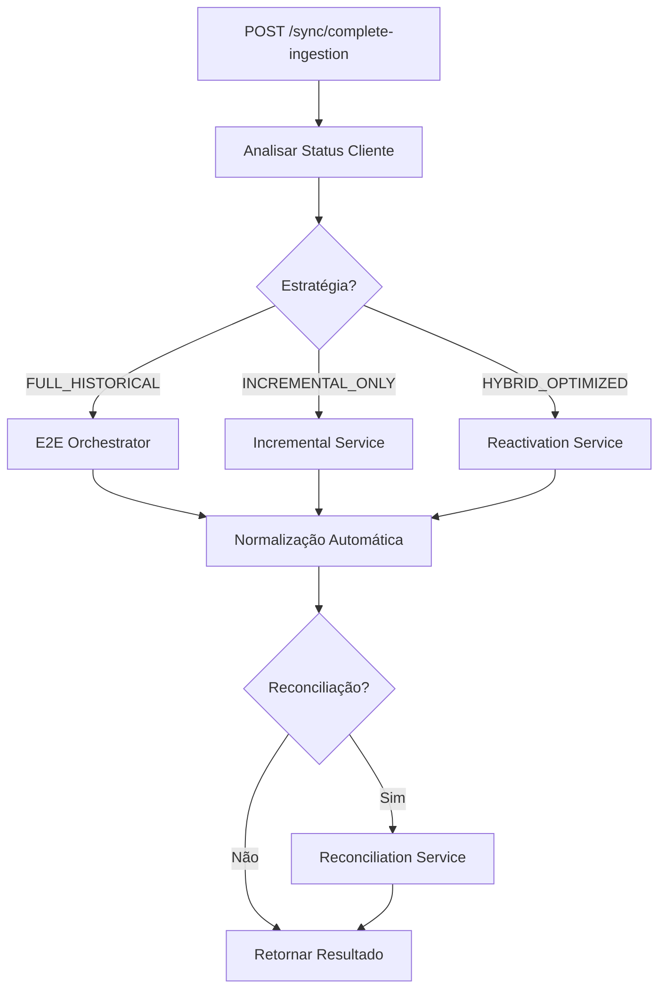

# Complete Sync Orchestrator - Sincronização B3 Inteligente

## 🎯 Visão Geral

O **Complete Sync Orchestrator** é o endpoint unificado para sincronização completa e inteligente de dados B3. Ele analisa automaticamente o status do cliente (novo vs existente) e executa a estratégia ideal de ingestão e normalização.

## 🚀 Endpoints

### 1. Sincronização Completa
```http
POST /api/v1/b3/sync/complete-ingestion
```

**Funcionalidade:** Executa fluxo completo de sincronização B3 com decisão automática de estratégia.

### 2. Análise de Status
```http
GET /api/v1/b3/sync/status-analysis?cpf=12345678901
```

**Funcionalidade:** Analisa status do cliente e retorna estratégia recomendada sem executar.

## 📋 Parâmetros de Entrada

### Sincronização Completa
```json
{
  "cpf": "12345678901",
  "assetTypes": ["equity"],
  "dataTypes": ["transactions", "positions"],
  "includeReconciliation": true,
  "dryRun": false,
  "force": false
}
```

| Campo | Tipo | Obrigatório | Descrição |
|-------|------|-------------|-----------|
| `cpf` | string | ✅ | CPF do cliente (11 dígitos) |
| `assetTypes` | []string | ❌ | Tipos de ativo (default: ["equity"]) |
| `dataTypes` | []string | ❌ | Tipos de dados (default: ["transactions", "positions"]) |
| `includeReconciliation` | boolean | ❌ | Executar reconciliação após ingestão (default: false) |
| `dryRun` | boolean | ❌ | Modo simulação (default: false) |
| `force` | boolean | ❌ | Forçar reprocessamento (default: false) |

## 🧠 Estratégias Inteligentes

### 1. Cliente Novo (FULL_HISTORICAL)
- **Situação:** Primeiro acesso ao sistema
- **Ação:** Ingestão histórica completa desde 2019-11-01
- **Tempo estimado:** 2-4 horas
- **Serviço usado:** E2E Orchestrator

### 2. Cliente Atual (INCREMENTAL_ONLY)
- **Situação:** Gap ≤ 30 dias
- **Ação:** Sincronização incremental desde última data
- **Tempo estimado:** 1-5 minutos
- **Serviço usado:** Incremental Service

### 3. Cliente Desatualizado (HYBRID_OPTIMIZED)
- **Situação:** Gap > 30 dias
- **Ação:** Reativação inteligente (híbrida)
- **Tempo estimado:** 5-30 minutos
- **Serviço usado:** Reactivation Service

## 📊 Formato de Resposta

```json
{
  "strategy": "FULL_HISTORICAL",
  "clientStatus": "new",
  "executionPlan": "complete_historical_ingestion",
  "reactivationPlan": {
    "strategy": "FULL_HISTORICAL",
    "reason": "Cliente novo - sem histórico B3",
    "gapDays": 1500,
    "estimatedMinutes": 120
  },
  "e2eResult": {
    "raw": {
      "saved": 1500,
      "skipped": 0,
      "errors": 0,
      "monthsProcessed": 24,
      "pagesProcessed": 150
    },
    "normalized": {
      "inserted": 800,
      "updated": 0,
      "skipped": 0,
      "errors": 0
    },
    "durationMs": 1800000
  },
  "reconciliationResult": {
    "status": "completed",
    "inconsistenciesFound": 2
  },
  "startedAt": "2024-01-15T10:00:00Z",
  "finishedAt": "2024-01-15T10:30:00Z",
  "durationMs": 1800000,
  "success": true,
  "newDataIngested": true,
  "dataSummary": {
    "rawRecordsIngested": 1500,
    "transactionsNormalized": 800,
    "positionsNormalized": 400,
    "inconsistenciesFound": 2
  }
}
```

## 🔄 Fluxo de Execução



## 📝 Exemplos de Uso

### Cliente Novo
```bash
curl -X POST http://localhost:8080/api/v1/b3/sync/complete-ingestion \
  -H "Content-Type: application/json" \
  -H "X-Tenant-ID: status_invest" \
  -d '{
    "cpf": "12345678901",
    "includeReconciliation": true
  }'
```

**Resposta:**
```json
{
  "strategy": "FULL_HISTORICAL",
  "clientStatus": "new",
  "success": true,
  "newDataIngested": true,
  "dataSummary": {
    "rawRecordsIngested": 1500,
    "transactionsNormalized": 800
  }
}
```

### Cliente Existente
```bash
curl -X POST http://localhost:8080/api/v1/b3/sync/complete-ingestion \
  -H "Content-Type: application/json" \
  -H "X-Tenant-ID: status_invest" \
  -d '{
    "cpf": "98765432100",
    "dryRun": true
  }'
```

**Resposta:**
```json
{
  "strategy": "INCREMENTAL_ONLY",
  "clientStatus": "existing_current",
  "executionPlan": "incremental_sync_ingestion_dry_run",
  "success": true,
  "newDataIngested": false
}
```

### Análise de Status
```bash
curl "http://localhost:8080/api/v1/b3/sync/status-analysis?cpf=12345678901" \
  -H "X-Tenant-ID: status_invest"
```

**Resposta:**
```json
{
  "strategy": "INCREMENTAL_ONLY",
  "clientStatus": "existing_current",
  "recommendedPlan": "incremental_sync_ingestion_dry_run",
  "estimatedDuration": 1,
  "gapDays": 5,
  "lastSyncDate": "2024-01-10T15:30:00Z"
}
```

## ⚡ Vantagens

### 🧠 Inteligência Automática
- **Decisão automática** de estratégia baseada no histórico
- **Otimização de tempo** - evita reprocessamento desnecessário
- **Adaptação dinâmica** conforme situação do cliente

### 🔄 Fluxo Completo
- **Pipeline completo** em uma única chamada
- **Ingestão + Normalização** automática
- **Reconciliação opcional** integrada

### 📊 Observabilidade Total
- **Métricas detalhadas** de cada etapa
- **Logs estruturados** com contexto completo
- **Status em tempo real** do processamento

### 🛡️ Confiabilidade
- **Dry-run support** para validação
- **Error handling** robusto
- **Rollback automático** em caso de falha

## 🔧 Configuração

### Variáveis de Ambiente
```bash
# Configurações B3
B3_URL_DATA=https://api.b3.com.br
B3_CLIENT_ID=your_client_id
B3_CLIENT_SECRET=your_secret
B3_CERT_P12_PATH=/path/to/cert.p12

# Limites e Timeouts
B3_TIMEOUT_SECONDS=30
B3_MAX_RETRIES=3
B3_INITIAL_BACKOFF=1000
B3_MAX_BACKOFF=10000

# Data de início da API B3
B3_API_EARLIEST_DATE=2019-11-01
```

### Rate Limits
- **Complete Sync:** 5 requests/minute por tenant
- **Status Analysis:** 30 requests/minute por tenant
- **Reconciliação:** Automática com concorrência limitada

## 🎯 Use Cases

### 1. Onboarding de Cliente Novo
```bash
# Primeiro acesso - histórico completo
POST /sync/complete-ingestion
{
  "cpf": "12345678901",
  "includeReconciliation": true
}
```

### 2. Sincronização Diária
```bash
# Atualização incremental automática
POST /sync/complete-ingestion
{
  "cpf": "98765432100"
}
```

### 3. Reativação de Cliente
```bash
# Cliente inativo por período longo
POST /sync/complete-ingestion
{
  "cpf": "11122233344",
  "force": true,
  "includeReconciliation": true
}
```

### 4. Validação Prévia
```bash
# Verificar estratégia sem executar
GET /sync/status-analysis?cpf=12345678901
```

## 🔍 Monitoramento

### Métricas Prometheus
```
# Contadores por status
complete_sync_orchestrator_total{status="success|error"}

# Duração por estratégia
complete_sync_orchestrator_duration_seconds{strategy="FULL_HISTORICAL|INCREMENTAL_ONLY|HYBRID_OPTIMIZED",client_status="new|existing_current|existing_outdated"}
```

### Logs Estruturados
```json
{
  "timestamp": "2024-01-15T10:00:00Z",
  "level": "info",
  "service": "complete_sync_orchestrator",
  "tenantId": "status_invest",
  "cpfMasked": "123********",
  "strategy": "FULL_HISTORICAL",
  "durationMs": 1800000,
  "newDataIngested": true
}
```

## 🚨 Troubleshooting

### Erro Comum 1: Cliente não encontrado
```json
{
  "error": "Failed to analyze client sync status: client not found"
}
```
**Solução:** Verificar se o CPF está correto e o cliente existe no sistema.

### Erro Comum 2: Rate limit atingido
```json
{
  "error": "RATE_LIMIT_EXCEEDED"
}
```
**Solução:** Aguardar reset do rate limit ou usar dry-run para análise.

### Erro Comum 3: Timeout B3
```json
{
  "error": "Full historical ingestion failed: B3 timeout"
}
```
**Solução:** Retry automático ou executar em horários de menor carga.

---

> **💡 Dica:** Use sempre `dryRun: true` primeiro para validar a estratégia antes de executar o processamento real, especialmente para clientes novos que demandam muito tempo.
